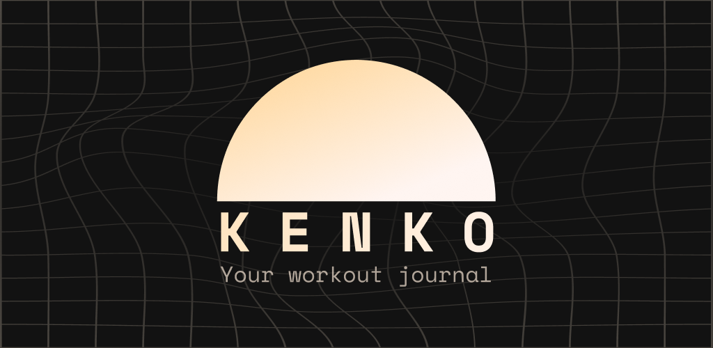
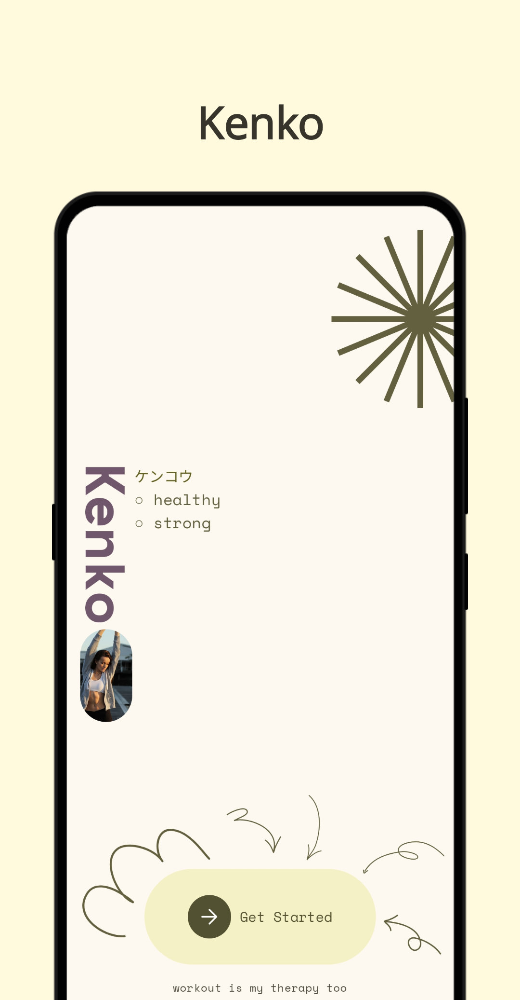
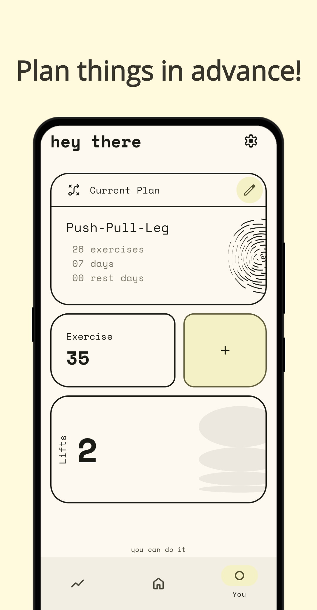
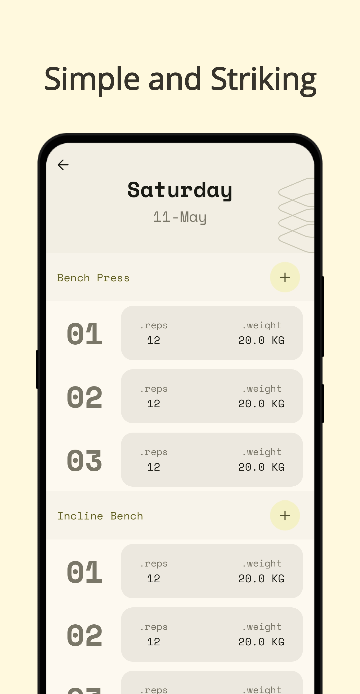
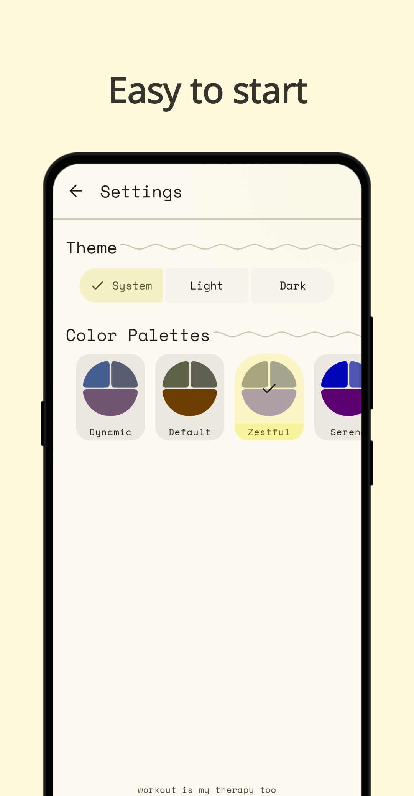

<div align="center">



Kenko is a workout journal which will provide you with appropriate progressive-overload and well
thought-out plans

</div>

<div align="left">

## Screenshots



## CHANGELOGS
- Full changelog: [here](https://github.com/Iamlooker/Kenko/blob/main/CHANGELOG.md)
- Unreleased changes: [here](https://github.com/Iamlooker/Kenko/blob/main/CHANGELOG.md#unreleased)

## TODO

- [x] Add Rating System
- [ ] Provide Targeted Overload
- [ ] Add Import/Export
- [x] Add Support for Isometric exercises

## LICENSE

```
Kenko

Copyright (C) 2025 LooKeR & Contributors
This program is free software: you can redistribute it and/or modify
it under the terms of the GNU General Public License as published by
the Free Software Foundation, either version 3 of the License, or
(at your option) any later version.
This program is distributed in the hope that it will be useful,
but WITHOUT ANY WARRANTY; without even the implied warranty of
MERCHANTABILITY or FITNESS FOR A PARTICULAR PURPOSE.  See the
GNU General Public License for more details.
You should have received a copy of the GNU General Public License
along with this program.  If not, see <http://www.gnu.org/licenses/>.
```

</div>
